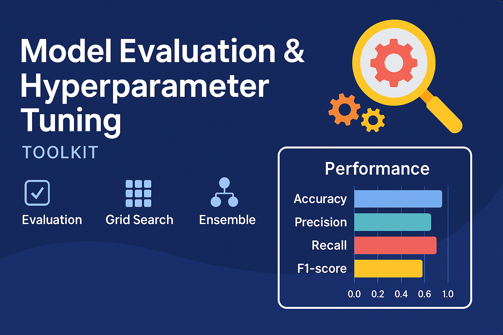

<p align="center">
  
</p>

# 🚀 Model Evaluation & Hyperparameter Tuning Toolkit


A comprehensive and modular toolkit for evaluating machine learning models and optimizing their performance using advanced hyperparameter tuning techniques and ensemble strategies.

---

## ✨ Features

✅ Evaluate multiple models using:
- Accuracy, Precision, Recall, F1-score
- Cross-Validation (CV)

✅ Optimize with:
- `GridSearchCV` 🔍
- `RandomizedSearchCV` 🎲

✅ Advanced ML Techniques:
- Ensemble models: VotingClassifier, StackingClassifier
- Scalable design for real-world ML workflows

✅ Visual Insights:
- Comparative bar chart of model metrics

---

## 📦 Installation

```bash
git clone https://github.com/jhakeshav25/model-evaluation-hyperparameter-tuning.git
cd model-evaluation-hyperparameter-tuning

# (Optional) Create virtual environment
python -m venv venv
venv\Scripts\activate

# Install dependencies
pip install -r requirements.txt
```

---

## ▶️ How to Use

```bash
python src/main.py
```

Or use the modular components in your own project:

```python
from src.evaluation import evaluate_model
from src.tuning import grid_search_tuning
from src.visualization import plot_metrics
```

---

## 📚 Notebooks

- 📘 `1. Model Evaluation.ipynb`  
- 📘 `2. Hyperparameter Tuning.ipynb`  
- 📘 `3. Advanced Techniques.ipynb`

---

## 📊 Results Table

| Metric    | Description                     | Best Use Case                     |
|-----------|---------------------------------|-----------------------------------|
| Accuracy  | Overall model correctness       | When classes are balanced         |
| Precision | Positive prediction quality     | When False Positives are costly   |
| Recall    | Positive case coverage          | When False Negatives are costly   |
| F1-score  | Balance between P & R           | When dealing with imbalanced data |

---

## 📁 Project Structure

```
model-evaluation-hyperparameter-tuning/
├── data/
├── notebooks/
├── src/
│   └── main.py
├── results/
│   ├── final_metrics.csv
│   └── metrics_plot.png
├── assets/
│   └── banner.png                # Project banner
├── requirements.txt
├── README.md
└── .gitignore
```

---

## 🧑‍💻 Author

**Keshav Kumar Jha**  
📧 [keshavkumarjha528@gmail.com](mailto:keshavkumarjha528@gmail.com)  
📍 Greater Noida, India  
🔗 [GitHub](https://github.com/jhakeshav25) • [LinkedIn](https://www.linkedin.com/in/keshav-kumar-jha-aa560022a/) • [LeetCode](https://leetcode.com/u/jhakeshav25/) • [GeeksforGeeks](https://www.geeksforgeeks.org/user/jhakeshav25/)

---

## 📜 License

This project is licensed under the [MIT License](https://opensource.org/licenses/MIT) © 2025 [Keshav Kumar Jha](https://github.com/jhakeshav25)

---

## 🙌 Contributing

Pull requests are welcome!  
Feel free to fork the repo and submit a PR to contribute new models, datasets, or enhancements.
